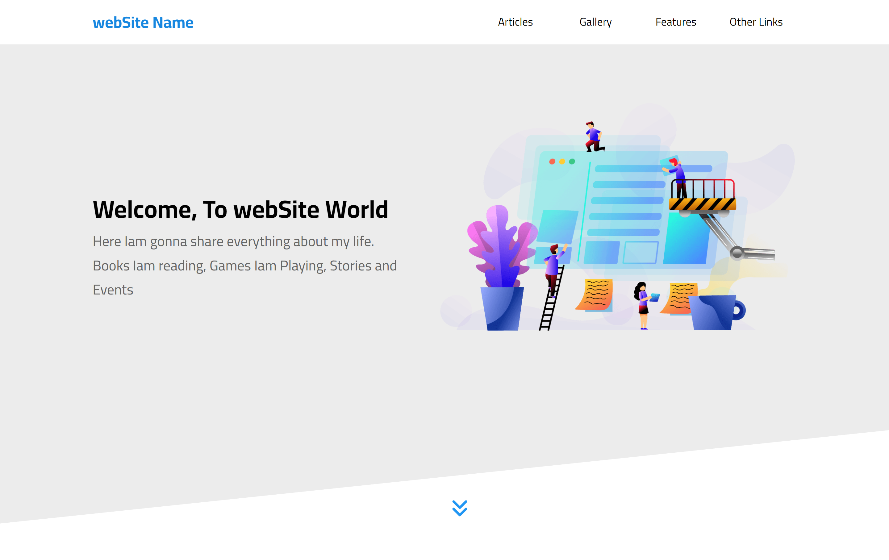
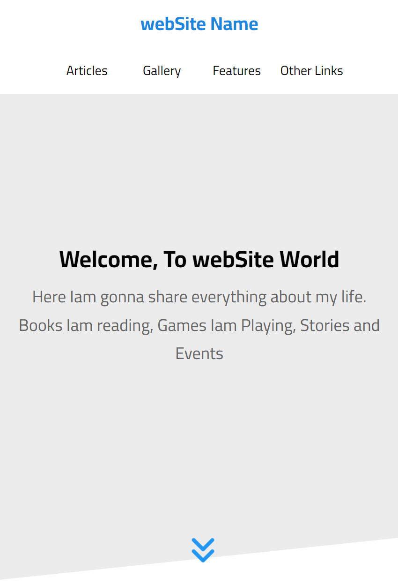

# Website Template for Front-End Development Training

This is a template made for purpose of training similar to [Elzero Web School Third Template](https://github.com/ElzeroWebSchool/HTML_And_CSS_Template_Three).

## Table of contents

- [Overview](#overview)
  - [Screenshot](#screenshot)
  - [Links](#links)
- [My process](#my-process)
  - [Updates](#updates)
    - [What I Did](#what-i-did)
    - [Changes](#changes)
    - [What I'll Do](#what-ill-do)
  - [Built with](#built-with)
  - [Planing To](#planing-to)
- [Author](#author)

## Overview

### Screenshot

### Links

- Live Site URL: [Live site URL here](https://mohamed-waled.github.io/webSite/).

## My process

### Updates

#### What I Did

- Build These Sections (13 / 16):
  - Header.
  - Landing.
  - Articles.
  - Gallery.
  - Features.
  - Testimonials.
  - Team Members.
  - Services.
  - Our Skills.
  - How it Works.
  - Latest Events.
  - Pricing Plans.
  - Top Videos.

#### Changes

##### These Are Some Changes I've Made From The Main Design:

- Header:
  - The Hover of The Links.
- The Main Title of all Sections:
  - I Made it by Hover Not Animation.
- Team Members:
  - I Made exactly The Oppsite as The Main Design is Colored and in Hover is Gray and Mine is The Oppsite as it's Gray and in Hover is Colored
- Top Videos:
- I Put The Time of The Videos in The Same Line as its name so that The Video Player Seems More Realistic and Tidy, and To Remove The Unnecessary Empty Space Under The Video Previewer

#### What I'll Do

- Build The Remaining Sections (3 Sections To End):
  - ~~Header.~~
  - ~~Landing.~~
  - ~~Articles.~~
  - ~~Gallery.~~
  - ~~Features.~~
  - ~~Testimonials.~~
  - ~~Team Members.~~
  - ~~Services.~~
  - ~~Our Skills.~~
  - ~~How it Works.~~
  - ~~Latest Events.~~
  - ~~Pricing Plans.~~
  - ~~Top Videos.~~
  - Our Awesome States.
  - Request a Discount.
  - Footer.

### Built with

- Semantic HTML5 markup.
- CSS custom properties.
- SASS.
- Flexbox.
- Grid.
- CSS Media Queries.
- Normalize.
- Font Awesome.
- Visual Studio Code.
- Prepros.

### Planing To

- Upgrade it by Adding Some Features Using JavaScript.
- Upgrade it by Using React.
- Upgrade it by Adding Dark Mode.
- Upgrade it by Adding Another Language.

## Author

- Frontend Mentor - [@Mohamed-Waled](https://www.frontendmentor.io/profile/Mohamed-Waled)
- Linkedin - [@mohamed-waled](https://www.linkedin.com/in/mohamed-waled-82a51a1bb/)
- Leet Code - [@MohamedWaled](https://leetcode.com/MohamedWaled/)
